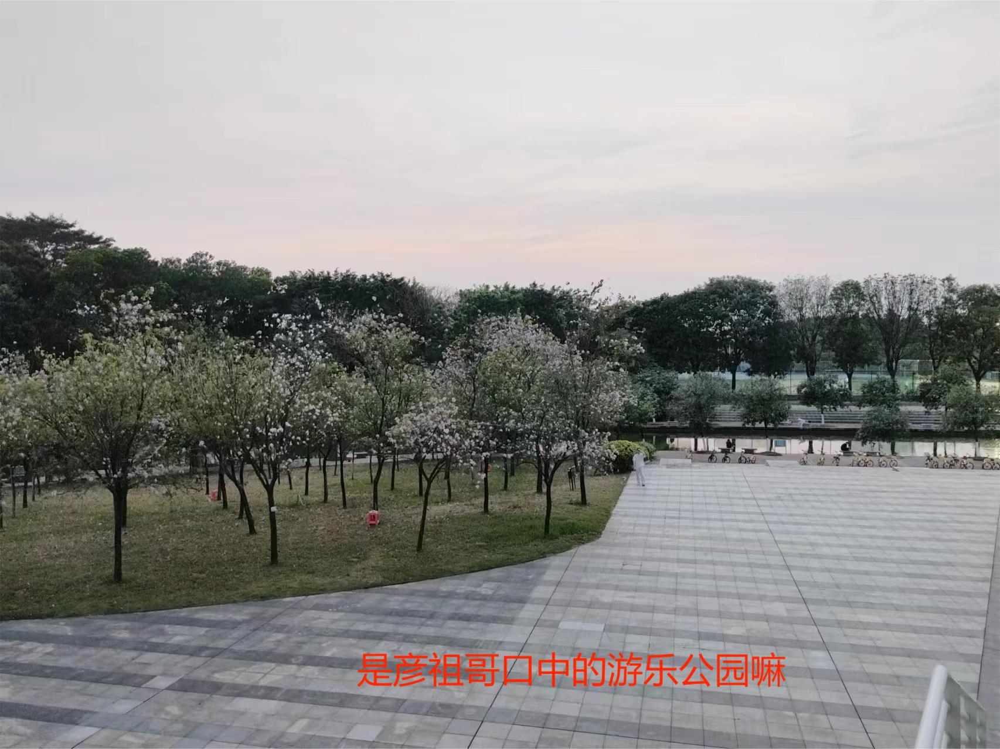

# 小周记一篇
<table><tr><td bgcolor=pink>
<font face='蓝灰色' color=#7B68EE size=4>

## 生活随记
   - 好像生活中没有遇到什么特别的事，又或者是记忆不太好了，刚记的东西一下就忘了 连续两周上古筝课忘带义甲了 呜呜呜~
   - 哦哦哦，忘记了，抓拍到了奥特曼师兄，虽然他说是师姐，不过我还真希望站在他旁边的是ta npy  
   <details>
        <summary> 有惊喜</summary>



   </details>
 
 ## 一周总结
 1. 这周明显上强度了，大组作业都写了一个周末，心里也很慌张，不知道怎么办
 2. 小组作业感觉还是很难的，自己第一次完成数据分析，包括数据预处理，可视化，线性回归一堆东西，脑子里完全没有一个正确的模板,总之我的作业就是***屎山***。
 3.  说实话，我在训练营学习上花了太多时间但是并没有很好的效果，**对于人工智能的学习，我没有一个很好的学习方法，有时候真的希望师兄能指点指点，给个方向。求求~**
   
## 存在问题
- 还是延续上周的情况，学习真的不够专注，可能是我一下子学太久了，但又没解决什么问题
- 锻炼的不够多，学习和休息不够协调
- 学过的知识没有足够的复习，这周都没时间预习下周的知识了
## 下周规划
- 争取改变自己三天打鱼两天晒网的坏习惯
- 争取尽可能的学习完图论和多智能体系统一致性
</font>
</table>

<table><tr><td bgcolor=gold>
 
 ## 学习笔记
  ### K-means 算法
   - 算法过程：
   1. 任给一群散点，在其中任选K个聚类中心（K根据需要确定）
   2. 除去聚类中心的散点分别计算其与聚类中心的距离，取距离与这些散点最短的聚类中心标记为该聚类中心的类型（有K个类型）可以理解为把这群散点分成K个区域
   3. 接着以聚类中心的区域重新计算平均值（也可以理解为已划分区域新的聚类中心）
   4. 如果新的聚类中心与原中心点相同则结束，否则继续重复2，3操作
   - 代码实现
      <details>
        <summary> 案例</summary>

        ```python
        from sklearn.cluster import Kmeans #导入KMeans
        #初始化KMeans对象，簇数为3，即聚类中心数为3
        a=KMeans(n_clusters=3)
        #拟合数据，找到聚类中心
        a.fit(data)
        #预测data中数据样本属于哪个聚类中心
        a.predict(data)
        ```
     </details>


  ### 梯度下降算法
- 算法过程：
1. 一元函数求导，多元函数求偏导得到的  一组向量称为梯度  
>  梯度：  $\theta_1=[\frac{\partial z}{\partial x},\frac{\partial z}{\partial y},]$
2. 利用迭代方法对梯度进行下降
> 数学公式：$\theta_n=\theta_{n-1}-alpha*\theta1*\theta_{n-1}$
> $\theta_1$为随机初始化的梯度 alpha为学习率
3. 直到$\theta$不在明显变化，稳定在某个很小的值，$\theta$就为我们需要的线性回归系数
4. 矩阵运算公式：
   >梯度：▽J(Θ)= $1/m* X.T (XΘ− y)$
   >均方误差函数：J(Θ)=$1/{2m}*(XΘ− y).T*(XΘ− y)$
   - 代码实现
   <details>
        <summary> 案例</summary>   
    
    ```python
    # 添加偏置项
    X_train = np.c_[np.ones(x_train.shape[0]), x_train]
    #设置学习率
    alpha=0.001
    #样本数
    m=489
    #定义代价函数
    def cost_function(theta,X,Y):
        diff=np.dot(X,theta)-Y    
        return (1/(2*m)) *np.dot(diff.transpose(), diff)

    #定义代价函数对应的梯度函数
    def gradient_function(theta,X,Y):
        diff=np.dot(X,theta)-Y
        return (1/m)*np.dot(X.T,diff)
   #1.4梯度下降迭代
    def gradient_descent(X,Y,alpha):
    #初始化theta_0theta_1
        global theta
        theta=np.random.rand(2,)
        gradient=gradient_function(theta,X,Y)
        for i in range(500000):
            theta=theta-alpha*gradient
            gradient=gradient_function(theta,X,Y)
        return theta
</details>     


    
